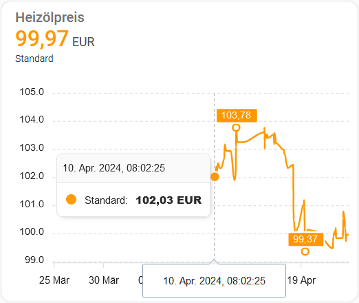

# homeassistant-heizoelpreis

Add the code in heizoelpreis.yaml to your configuration.yaml.  

Replace XXXXX with your german zip code / Postleitzahl. 
Replace 3000 with your amount of heating oil. Minimum is 500 i believe.  
Scan interval is 3600 for once an hour.  
You can add a chart on your dashboard (i use apexchart-card for long term), sensor is sensor.heizoelpreis 

